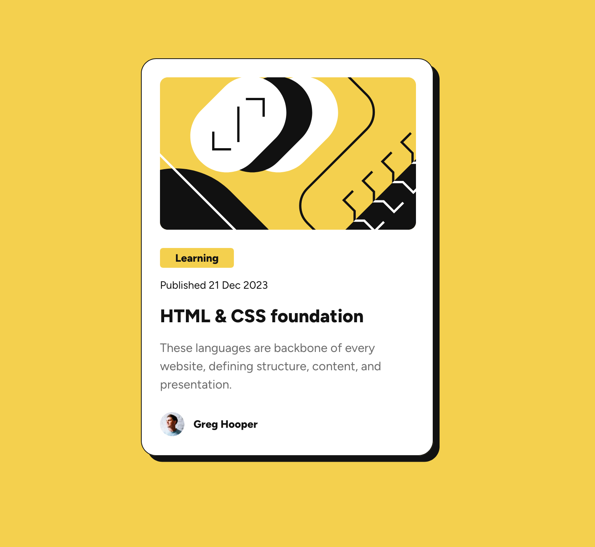
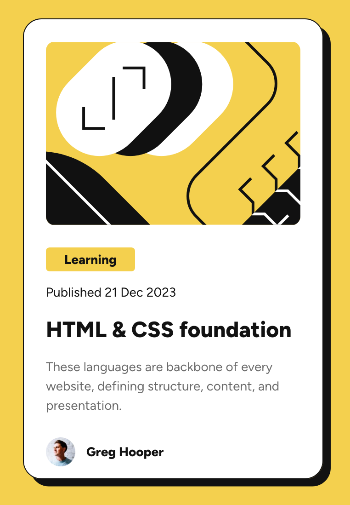

# Frontend Mentor - Blog preview card solution

This is a solution to the [Blog preview card challenge on Frontend Mentor](https://www.frontendmentor.io/challenges/blog-preview-card-ckPaj01IcS). Frontend Mentor challenges help you improve your coding skills by building realistic projects. 

## Table of contents

- [Overview](#overview)
  - [The challenge](#the-challenge)
  - [Screenshot](#screenshot)
  - [Links](#links)
- [My process](#my-process)
  - [Built with](#built-with)
  - [What I learned](#what-i-learned)


## Overview

### The challenge

Users should be able to:

- See hover and focus states for all interactive elements on the page
- The page should be responsive to user screen sizes

### Screenshot





### Links

- Solution URL: [Github source code](https://github.com/kjyothindrapavan/frontendmentor-00000010-blogpost-card)
- Live Site URL: [Netlify](https://lucky-froyo-b2d1f1.netlify.app/)

## My process
- First write markup for all the elements
- Create css variable for project for typography and spacing
- Build for mobile view and the extened for Desktop view

### Built with

- Semantic HTML5 markup
- CSS custom properties
- Flexbox
- Mobile-first workflow

### What I learned

- Declaring and using CSS custom porperties

```css
:root {
  --yellow-color: hsl(47, 88%, 63%);
}
body {
  background-color: var(--yellow-color);
}
```

- object-fit css property on image to cover entire width of parent
```css
img {
  object-fit: cover;
}
```
